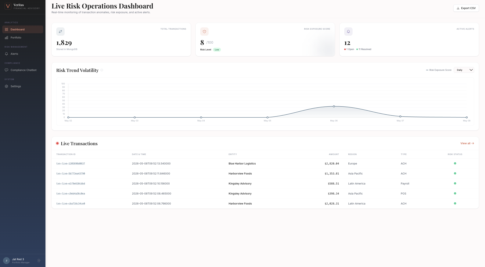
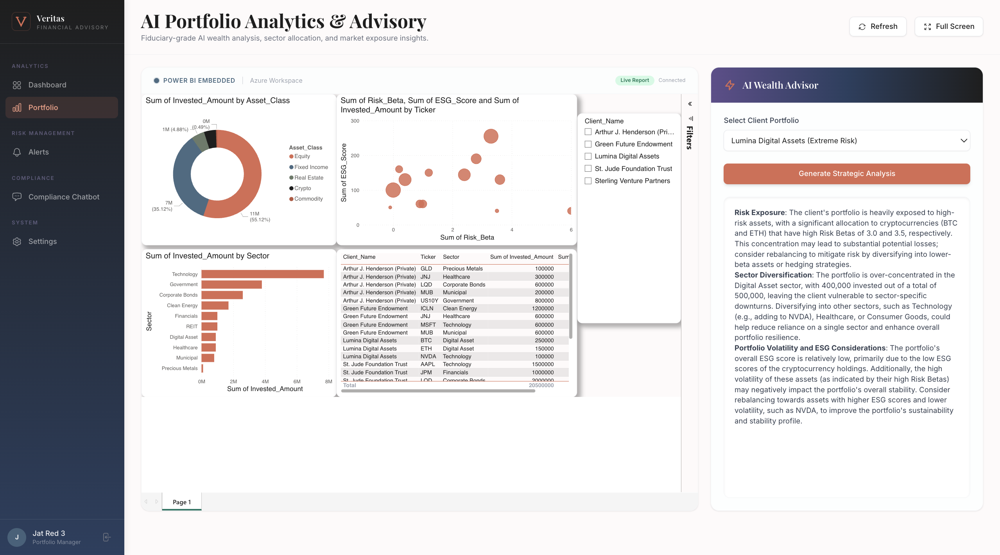
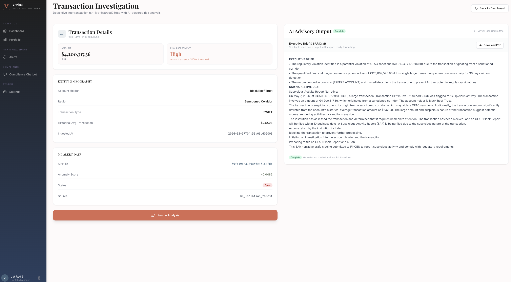
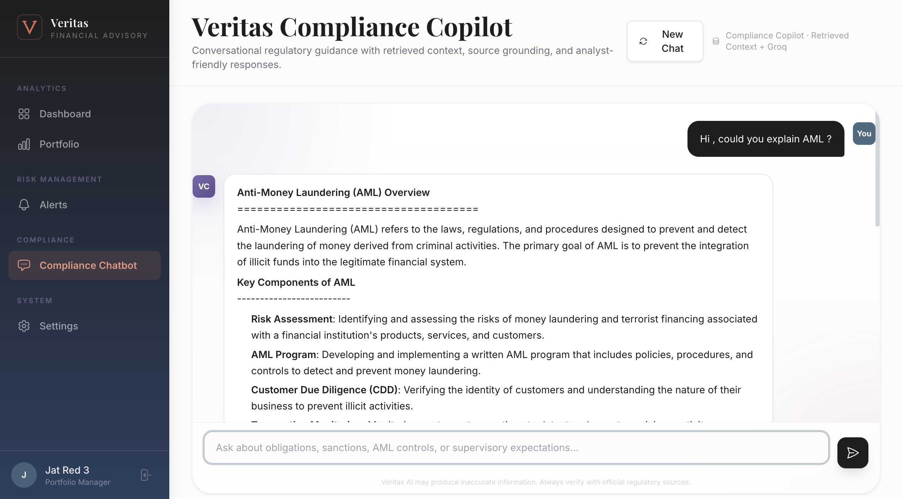
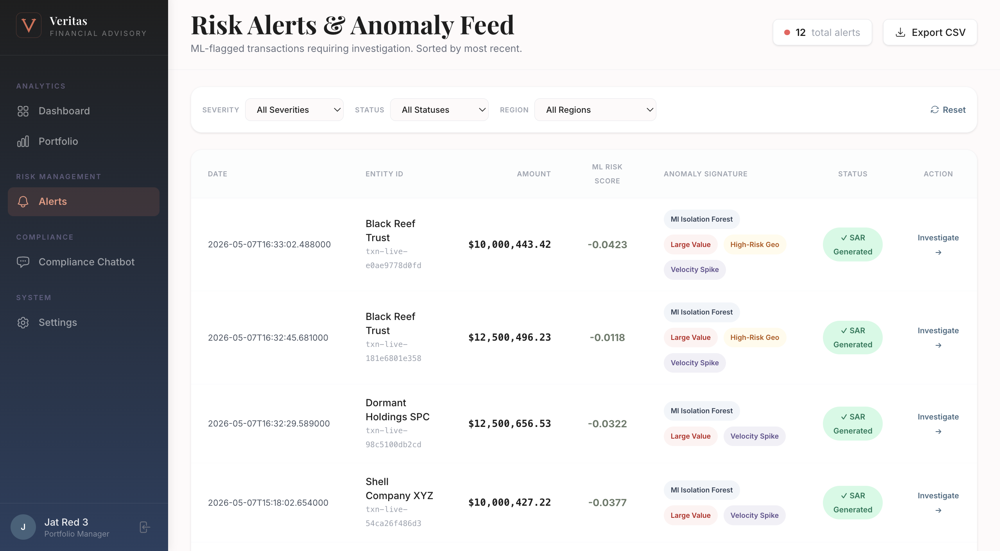
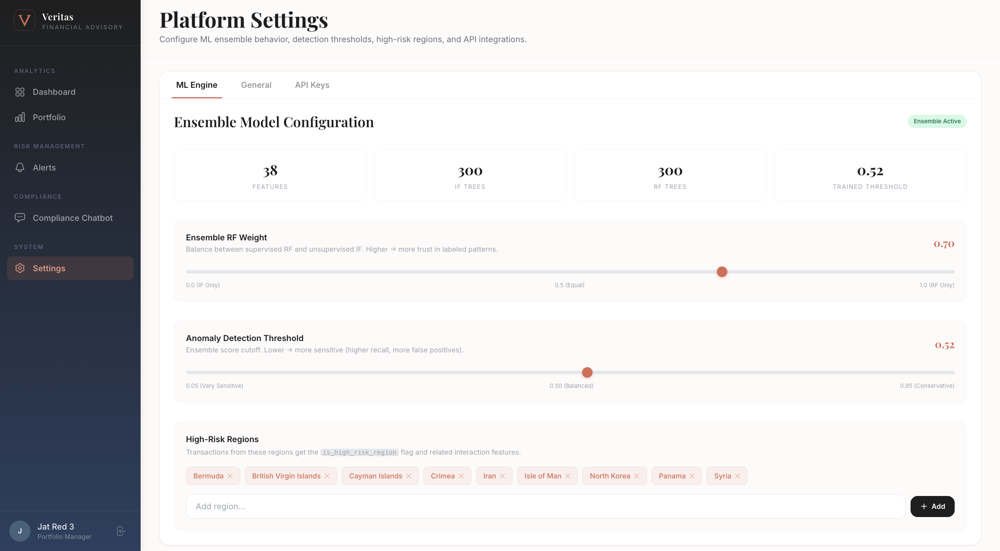
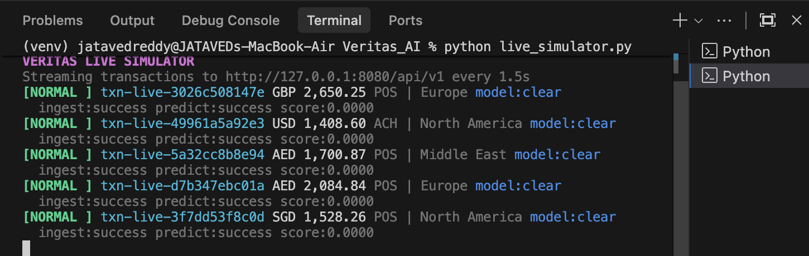
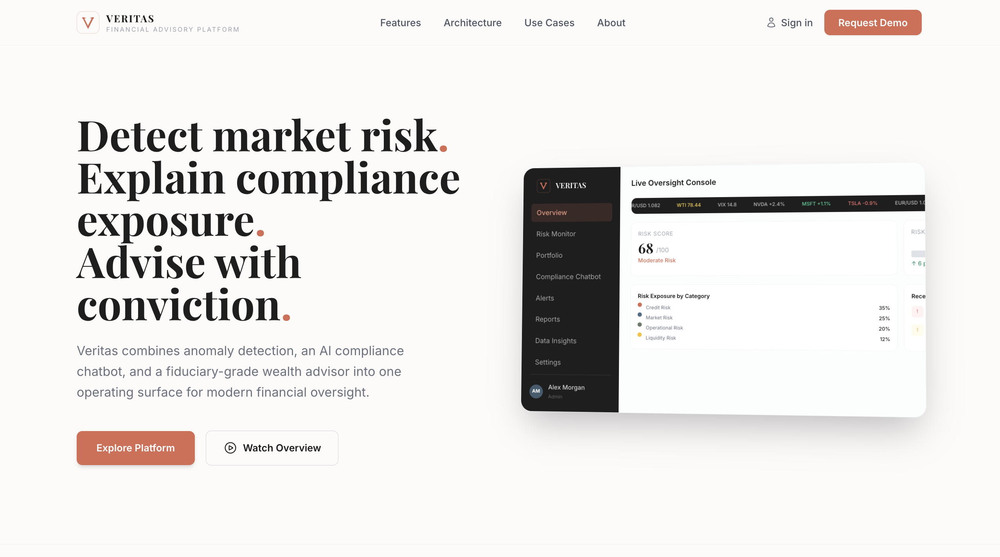

<p align="center">
  <svg xmlns="http://www.w3.org/2000/svg" viewBox="0 0 48 48" fill="none" width="72" height="72">
    <rect width="48" height="48" rx="10" fill="#1E1E1E"/>
    <path d="M8 8L24 40L40 8" stroke="#D96B52" stroke-width="5" stroke-linecap="square" stroke-linejoin="miter" fill="none"/>
    <path d="M5 8H14" stroke="#D96B52" stroke-width="3" stroke-linecap="square"/>
    <path d="M34 8H43" stroke="#D96B52" stroke-width="3" stroke-linecap="square"/>
  </svg>
</p>

<h1 align="center">Veritas — AI-Powered Financial Risk & Advisory Platform</h1>

<p align="center">
  <em>Enterprise-grade anomaly detection, multi-agent compliance analysis, and fiduciary wealth advisory — powered by ensemble ML and generative AI.</em>
</p>

<p align="center">
  
  
  
  
  
  
  
</p>

---

## 📸 Screenshots

| Dashboard | AI Wealth Advisor |
|:---------:|:-----------------:|
|  |  |

| Transaction Investigation | Compliance Chatbot |
|:-------------------------:|:------------------:|
|  |  |

| Alerts Management | Platform Settings |
|:-----------------:|:-----------------:|
|  |  |

| Live Simulator (Terminal) | Landing Page |
|:-------------------------:|:------------:|
|  |  |

---

## 🏗️ Architecture Overview

Veritas is built as a modular, full-stack platform with four tightly integrated subsystems:

```
┌─────────────────────────────────────────────────────────────────────┐
│                        FRONTEND (Jinja2 + Tailwind)                │
│   Dashboard │ Alerts │ Investigation │ Portfolio │ Compliance Chat  │
└────────────────────────────────┬────────────────────────────────────┘
                                 │ HTTP/JSON
┌────────────────────────────────▼────────────────────────────────────┐
│                    FLASK API (Blueprint: /api/v1)                   │
│  /ingest │ /predict │ /advise │ /chat │ /search │ /portfolio/analyze│
└──────┬──────────┬──────────────┬────────────────────────────────────┘
       │          │              │
       ▼          ▼              ▼
  ┌─────────┐ ┌──────────┐ ┌──────────────────────────────────┐
  │ MongoDB │ │ ML Engine│ │     CrewAI Multi-Agent System    │
  │ cosmos  │ │ IF + RF  │ │  Auditor → Analyst → CRO         │
  │         │ │ Ensemble │ │ + RAG (Azure AI Search / Local)  │
  └─────────┘ └──────────┘ └──────────┬───────────────────────┘
                                       │
                              ┌────────▼────────┐
                              │   Groq LLM API  │
                              │Meta-LLama-scout │
                              └─────────────────┘
```

---

## ✨ Key Features

### 🤖 Machine Learning Anomaly Detection

- **Dual-Model Ensemble** combining an unsupervised Isolation Forest (catches novel, unseen threats) with a supervised Random Forest (catches known fraud patterns)
- **39-Feature Engineering Pipeline** including Z-scores, structuring detection, velocity metrics, temporal patterns, and interaction terms
- **F1-Optimized Threshold** (0.52) swept across 100 candidates to balance precision and recall
- Real-time scoring via the `/predict` API endpoint

### 🧠 Virtual Risk Committee (Multi-Agent AI)

- **3 Specialized AI Agents** orchestrated sequentially via CrewAI:
  - **Senior Compliance Auditor** — Searches the regulatory knowledge base via RAG, cites specific statutes
  - **Quantitative Risk Analyst** — Calculates financial exposure, velocity, and standard deviations
  - **Chief Risk Officer** — Synthesizes findings into an executive brief and drafts a SAR (Suspicious Activity Report)
- Powered by **Groq** (Llama 3 70B) at `temperature=0.1` for deterministic, hallucination-resistant output

### 📚 RAG-Powered Knowledge Base

- **20 regulatory documents** covering Basel III, SEC Rule 10b-5, BSA/AML, OFAC Sanctions, GDPR, SOX, PCI-DSS, MiFID II, Dodd-Frank, and more
- Vector embeddings generated via **Azure OpenAI** (`text-embedding-3-small`)
- Indexed in **Azure AI Search** with HNSW vector similarity
- Local fallback using **cosine similarity** over pre-computed embeddings

### 💼 AI Wealth Advisor

- RAG-enhanced portfolio analysis using real client holdings data (Asset Class, Sector, Risk Beta, ESG Score)
- LLM generates fiduciary-grade strategic advice (risk exposure, sector diversification, ESG considerations)
- Integrated alongside **Power BI Embedded** dashboards

### 🛡️ Compliance Chatbot

- Conversational interface for regulatory Q&A
- Context-aware with 20-message conversation history
- Sources cited from the vector knowledge base for auditability

### 📊 Real-Time Operations Dashboard

- Live transaction feed with 2-second auto-refresh polling
- Risk Trend Volatility chart (Chart.js) with Daily/Weekly/Monthly views
- Metric cards: Total Transactions, Risk Exposure Score, Active Alerts (Open/Resolved)
- CSV export functionality

### 🔒 Authentication & Session Management

- Session-based authentication with `@login_required` decorator
- PBKDF2-SHA256 password hashing via Werkzeug
- Role-based user profiles (Analyst, Admin)

---

## 🗂️ Project Structure

```
Veritas_AI/
├── backend/
│   ├── app.py                   # Flask application factory, Blueprint, all API routes
│   ├── database.py              # MongoDB connection singleton & collection bindings
│   └── templates/
│       ├── base.html            # Master layout (sidebar, header, Jinja2 blocks)
│       ├── landing.html         # Public landing page
│       ├── login.html           # Authentication pages
│       ├── register.html
│       ├── dashboard.html       # Live operations dashboard
│       ├── alerts.html          # Alert management table
│       ├── investigate.html     # Transaction deep-dive + AI agent output
│       ├── portfolio.html       # Power BI embed + AI Wealth Advisor
│       ├── compliance.html      # RAG-powered compliance chatbot
│       └── settings.html        # ML engine & platform configuration
│
├── agents/
│   ├── risk_committee.py        # CrewAI multi-agent workflow (3 agents, RAG tool)
│   └── setup_azure_search.py   # Vector index builder (20 regulatory documents)
│
├── ml/
│   ├── train_model.py           # Training pipeline (feature engineering, IF+RF, threshold optimization)
│   └── models/                  # Serialized inference artifacts
│       ├── isolation_forest.joblib
│       ├── random_forest.joblib
│       ├── scaler.joblib
│       ├── encoder_columns.joblib
│       ├── feature_config.joblib
│       └── threshold.joblib
│
├── data/
│   ├── synthetic_data_gen.py    # Synthetic transaction generator (5 anomaly scenarios)
│   ├── raw/                     # Generated CSV/JSON datasets
│   └── processed/               # Regulatory embeddings fallback
│
├── live_simulator.py            # Real-time transaction streamer for demos
├── seed_db.py                   # MongoDB seeder script
├── wsgi.py                      # Gunicorn WSGI entry point
├── startup.sh                   # Azure App Service startup script
├── requirements.txt             # Python dependencies
└── .github/workflows/
    └── main_veritas-platform-web-app.yml  # CI/CD pipeline (GitHub Actions → Azure)
```

---

## 🛠️ Tech Stack

| Layer                    | Technology                                                     |
| ------------------------ | -------------------------------------------------------------- |
| **Backend**        | Python 3.11, Flask 3.1, Gunicorn                               |
| **Database**       | MongoDB Atlas (via Flask-PyMongo)                              |
| **ML Models**      | scikit-learn (Isolation Forest + Random Forest), Pandas, NumPy |
| **AI Agents**      | CrewAI, LangChain, Groq (Llama 3 70B)                          |
| **RAG / Search**   | Azure AI Search (HNSW vectors), Azure OpenAI Embeddings        |
| **Frontend**       | Jinja2, Tailwind CSS, Chart.js, marked.js, jsPDF               |
| **BI / Analytics** | Power BI Embedded                                              |
| **Deployment**     | Azure App Service, GitHub Actions (OIDC), Oryx Build           |
| **Security**       | Werkzeug (PBKDF2-SHA256), Flask Sessions, dotenv               |

---

## 🚀 Getting Started

### Prerequisites

- Python 3.11+
- MongoDB (local or Atlas connection string)
- API Keys: Groq, Azure OpenAI (optional), Azure AI Search (optional)

### 1. Clone & Install

```bash
git clone https://github.com/yourusername/Veritas_AI.git
cd Veritas_AI
python -m venv venv
source venv/bin/activate      # macOS/Linux
pip install -r requirements.txt
```

### 2. Configure Environment

Create a `.env` file in the project root:

```env
# ── Required ──────────────────────────────────────
MONGO_URI=mongodb+srv://<user>:<password>@<cluster>.mongodb.net/veritas
GROQ_API_KEY=gsk_xxxxxxxxxxxxxxxxxxxxxxxx
SECRET_KEY=your-random-secret-key

# ── Optional (for RAG / Embeddings) ───────────────
AZURE_SEARCH_ENDPOINT=https://<service>.search.windows.net
AZURE_SEARCH_KEY=your-azure-search-key
AZURE_OPENAI_ENDPOINT=https://<resource>.openai.azure.com
AZURE_OPENAI_KEY=your-azure-openai-key
```

### 3. Generate Synthetic Data & Train Models

```bash
# Generate 5,400 synthetic transactions (5,000 normal + 400 anomalies)
python -m data.synthetic_data_gen

# Train the Isolation Forest + Random Forest ensemble
python -m ml.train_model
```

### 4. Seed the Database

```bash
python seed_db.py
```

### 5. Run the Application

```bash
# Development server
python -c "from backend.app import create_app; create_app().run(debug=True, port=8080)"

# Production (Gunicorn)
gunicorn --bind=0.0.0.0:8000 --timeout 600 wsgi:app
```

### 6. Run the Live Simulator (Optional)

In a separate terminal, stream live transactions to see the dashboard light up:

```bash
python live_simulator.py
```

---

## 🔬 ML Pipeline Deep Dive

### Synthetic Data Generation

The `data/synthetic_data_gen.py` script creates realistic institutional transaction data and injects **5 anomaly scenarios**:

| Scenario                          | Description                                                    | Indicators                                 |
| --------------------------------- | -------------------------------------------------------------- | ------------------------------------------ |
| **Structuring (Smurfing)**  | Transactions of $9,990–$9,999 to evade the $10K CTR threshold | Clustered amounts, tight time window       |
| **Offshore Midnight Sweep** | $200K–$2M wires to tax havens between midnight–4 AM          | Large amount, offshore region, night hours |
| **Velocity Spike**          | 50+ micro-transactions ($1–$50) within seconds                | Extreme frequency, tiny amounts            |
| **Round-Trip Wash**         | Funds looped A→B then B→A with near-identical amounts        | Paired transactions, similar amounts       |
| **Geographic Mismatch**     | High-value SWIFT transfers to sanctioned regions               | SWIFT type, sanctioned destination         |

### Feature Engineering (39 Features)

The training pipeline engineers features across multiple categories:

- **Statistical:** Amount Z-score, log-transformed amount, deviation from historical average
- **Temporal:** Hour of day, day of week, is_weekend, is_night (trading hours flag)
- **Categorical:** One-hot encoded transaction type, currency, and region
- **Structuring Detection:** Binary flag for amounts in the $9,000–$9,999 range
- **Risk Flags:** High-risk region indicator, sanctioned corridor detection
- **Interaction Terms:** `amount × is_high_risk_region`, `is_night × amount_zscore`

### Ensemble Architecture

```
Transaction JSON
       │
       ▼
┌──────────────┐     ┌──────────────┐
│  Isolation   │     │   Random     │
│   Forest     │     │   Forest     │
│ (Unsupervised│     │ (Supervised) │
│  200 trees)  │     │  200 trees)  │
└──────┬───────┘     └──────┬───────┘
       │                     │
       ▼                     ▼
   IF Score              RF Score
  (0.3 weight)         (0.7 weight)
       │                     │
       └─────────┬───────────┘
                 ▼
          Ensemble Score
                 │
                 ▼
        Threshold (0.52)
         ╱            ╲
     ≥ 0.52        < 0.52
    🚨 ALERT        ✅ CLEAR
```

---

## 🧠 Virtual Risk Committee

The multi-agent AI system uses **CrewAI** with a `Process.sequential` workflow:

```
┌───────────────────┐     ┌───────────────────┐     ┌───────────────────┐
│  COMPLIANCE       │     │  QUANTITATIVE     │     │  CHIEF RISK       │
│  AUDITOR          │────▶│  ANALYST          │────▶│  OFFICER          │
│                   │     │                   │     │                   │
│  • Searches RAG   │     │  • Reads legal    │     │  • Reads both     │
│    knowledge base │     │    findings       │     │    reports        │
│  • Cites statutes │     │  • Calculates     │     │  • Executive brief│
│  • Legal report   │     │    financial risk │     │  • SAR draft      │
│                   │     │  • Quant report   │     │  • Final decision │
└───────────────────┘     └───────────────────┘     └───────────────────┘
```

**Output:** A markdown document containing an executive brief with regulatory citations, financial risk quantification, a recommended action (`[FREEZE ACCOUNT]`), and a government-ready SAR draft.

---

## ☁️ Deployment

### Azure App Service (Production)

The platform deploys automatically via **GitHub Actions**:

1. **Push to `main`** triggers the CI/CD workflow
2. **GitHub Actions** checks out code, validates dependencies on Python 3.11
3. **OIDC Authentication** securely logs into Azure (no stored passwords)
4. **Oryx Build Engine** runs `pip install` on Azure's servers
5. **`startup.sh`** locates the app, sets `PYTHONPATH`, and launches Gunicorn with a 600s timeout
6. **`wsgi.py`** serves as the WSGI entry point → `create_app()`

**Notable Production Fix:** The `pysqlite3` monkey-patch at the top of `app.py` replaces Python's built-in `sqlite3` module to satisfy ChromaDB's requirement for SQLite ≥ 3.35.0 on Azure's older Linux images.

---

## 🔐 Security

| Measure                      | Implementation                                               |
| ---------------------------- | ------------------------------------------------------------ |
| **Password Storage**   | PBKDF2-SHA256 with random salt (Werkzeug)                    |
| **Session Management** | Signed cookies via Flask `SECRET_KEY`                      |
| **Route Protection**   | `@login_required` decorator on all authenticated endpoints |
| **Secrets Management** | Environment variables via `.env` (excluded from Git)       |
| **OIDC Deployment**    | Passwordless Azure login via GitHub Actions JWT tokens       |

---

## 📬 API Reference

| Endpoint                        | Method       | Description                                       |
| ------------------------------- | ------------ | ------------------------------------------------- |
| `/api/v1/ingest`              | `POST`     | Persist raw transactions to MongoDB               |
| `/api/v1/predict`             | `POST`     | Score transactions with the ML ensemble           |
| `/api/v1/advise`              | `POST`     | Run the Virtual Risk Committee on a flagged alert |
| `/api/v1/chat`                | `POST`     | Compliance chatbot (RAG + LLM)                    |
| `/api/v1/search`              | `POST`     | Search the regulatory knowledge base              |
| `/api/v1/portfolio/analyze`   | `POST`     | AI Wealth Advisor analysis                        |
| `/api/v1/settings`            | `GET/POST` | Read/write platform configuration                 |
| `/api/v1/model_info`          | `GET`      | ML model metadata and statistics                  |
| `/api/v1/dashboard_live_data` | `GET`      | Real-time metrics and recent transactions         |

---

## 📄 License

This project is for educational and portfolio demonstration purposes.

---

<p align="center">
  Built with ❤️ by <strong>Jataved Reddy</strong>
</p>
